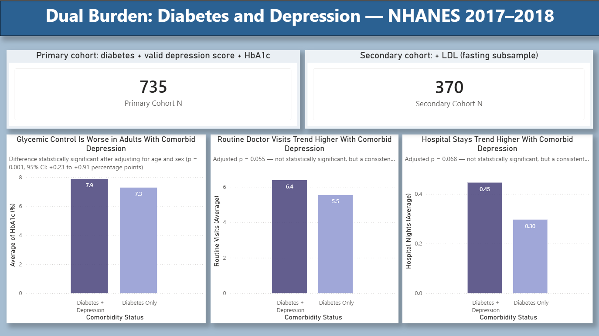

Dual Burden: Diabetes and Depression
Examining whether comorbid depression is associated with worse glycemic control and higher healthcare utilization in adults with type 2 diabetes, using NHANES 2017–2018 data.
Status: Core analysis complete. Dashboard live. See Future Work for planned extensions.
---
Overview
Type 2 diabetes and depression frequently co-occur, and each condition can make the other harder to manage. This project quantifies that relationship using a nationally representative U.S. health survey, testing whether adults with both conditions ("dual burden") show worse clinical outcomes and higher healthcare utilization than adults with diabetes alone.
Headline finding: Adults with comorbid depression had HbA1c levels 0.57 percentage points higher than adults with diabetes alone, after adjusting for age and sex (p = 0.001). Healthcare utilization (routine visits, hospital nights) trended consistently higher in the comorbid group as well, though these did not reach statistical significance at this sample size.
---
Business Question
Does comorbid depression/anxiety in adults with type 2 diabetes associate with worse glycemic control (HbA1c) and higher healthcare utilization — a proxy for cost burden — compared to adults with diabetes alone?
Why this question: Depression is known to reduce diabetes self-management — medication adherence, diet, activity — while the burden of a chronic disease diagnosis independently raises depression risk. This creates a reinforcing cycle: worse mental health leads to worse diabetes control, which increases disease burden, which further strains mental health. Despite this, mental health screening is not consistently built into diabetes care pathways.
Why it matters: If comorbid depression measurably worsens glycemic control and utilization, that's a direct, quantifiable case for integrating mental health screening into standard diabetes care — not just a "nice to have," but a lever that plausibly affects both patient outcomes and downstream healthcare cost.
Who benefits from answering it:
Health system / payer decision-makers get evidence to justify funding integrated screening programs, since the cost of adding a PHQ-9 screen to a diabetes visit is small relative to the utilization difference this analysis found
Pharma / HealthTech RWE teams get a real-world (rather than trial-based) view of how comorbidity affects outcomes, relevant to positioning treatments or digital health tools that address both conditions together
Clinicians get a concrete, population-level number ("0.57 points higher HbA1c") to motivate why a depression screen belongs in a diabetes visit, not just a general awareness that "mental health matters"
---
Data Source
National Health and Nutrition Examination Survey (NHANES), 2017–2018 cycle — U.S. Centers for Disease Control and Prevention (CDC).
Why this dataset: NHANES is a nationally representative, rigorously collected survey combining questionnaire data, physical exams, and laboratory measurements on the same individuals — a rare combination that lets this project connect a validated depression screener (PHQ-9) to an objective lab outcome (HbA1c) and self-reported utilization, all in one public, well-documented, freely downloadable source. The 2017–2018 cycle was chosen specifically as the most recent complete, pre-pandemic cycle, avoiding the data collection disruptions of later cycles.
Why not Finnish data: This was the first and most natural option to consider, given the project's Finnish context — but individual-level Finnish health register data (drug prescriptions, diagnoses, lab values linked at the patient level) is held by Findata and requires a formal research permit; it is not freely downloadable and cannot legally be redistributed in a public GitHub repository. Aggregate, non-individual Finnish statistics (e.g., via Kela or THL) do exist, but they cannot support the individual-level cohort analysis (grouping specific people by comorbidity status and comparing their outcomes) that this project's business question requires. NHANES was therefore the only realistic option offering true patient-level, freely public data suitable for this kind of analysis.
Fit to the business question: NHANES's combination of a validated depression screener, a direct clinical outcome (HbA1c), and self-reported utilization data covers every component of the business question in one linked dataset — a genuinely well-matched fit, with the one limitation that it does not capture healthcare cost in dollar terms (addressed in Limitations).
---
Methods
Step 1 — Data acquisition
Five NHANES 2017–2018 files were pulled programmatically (Python, Google Colab) directly from the CDC's public data server: demographics (`DEMO_J`), diabetes questionnaire (`DIQ_J`), depression screener (`DPQ_J`), glycohemoglobin lab (`GHB_J`), and healthcare utilization (`HUQ_J`). A sixth file, cholesterol/triglycerides (`TRIGLY_J`), was added later to bring in LDL as a secondary outcome. Files were converted from SAS transport format (`.xpt`) to CSV and loaded into Google BigQuery.
Step 2 — Cohort definition
The base cohort was defined as all NHANES respondents who self-reported a diabetes diagnosis (`DIQ010 = 1`, i.e., "has a doctor ever told you that you have diabetes"). This is a self-reported diagnosis, not a clinical or ICD-10-coded diagnosis — an important distinction, since self-report can miss undiagnosed diabetes or misremember diagnosis details. This yielded a base cohort of 893 respondents.
Step 3 — Depression score construction
Depression status was derived from the 9-item PHQ-9 screener (`DPQ010`–`DPQ090`), each scored 0–3, summed to a 0–27 total. A standard clinical cutoff of ≥10 was used to define "comorbid depression." Responses coded as refused (7) or don't know (9) were treated as missing, and any respondent missing even one of the nine items had their total score set to missing (rather than guessing a total from incomplete answers).
Data cleaning note: an initial version of this scoring logic returned depression scores that were almost entirely missing. Investigation traced this to a floating-point precision issue introduced when the SAS export's "0" values passed through the Python/CSV/BigQuery pipeline — they arrived as a near-zero value (e.g. `5.4e-79`) rather than a clean `0`, which silently failed an exact-match filter. The fix rounds each item before filtering, which resolved the issue (759 of 893 respondents had a valid PHQ-9 score afterward).
Step 4 — Outcome variable preparation
HbA1c (`LBXGH`) — used directly, reported in %.
LDL (`LBDLDL`) — reported by NHANES in mg/dL; converted to mmol/L (`× 0.02586`, the same factor NHANES uses internally for cholesterol unit conversion) for interpretability against Finnish/European clinical reference ranges. The original mg/dL column was dropped after validating the conversion, keeping a single unambiguous LDL column.
Healthcare utilization — NHANES's `HUQ_J` module does not contain a standalone emergency-room visit count; utilization was scoped to the two variables it does support: routine healthcare visits in the past year (`HUQ051`) and overnight hospital stays in the past year (`HUD080`). Both are reported as binned categories (e.g. "2 to 3 visits") rather than exact counts, and were converted to numeric estimates using bin midpoints (e.g. "2 to 3" → 2.5), following standard grouped-data methodology (Heitjan, D. F. (1989). Inference from grouped continuous data: A review. Statistical Science, 4(2), 164–179). The top, open-ended bin ("16 or more" visits; "6 or more" hospital nights) was conservatively assigned its floor value rather than a true midpoint, since no upper bound exists.
Data cleaning note: `HUD080` (hospital nights) initially appeared almost entirely missing. This was traced to NHANES's survey skip pattern — `HUD080` is only asked as a follow-up if a respondent answered "yes" to `HUQ071` ("were you hospitalized overnight in the past year"), so a "no" answer legitimately skips the follow-up rather than leaving it genuinely missing. The fix uses `HUQ071` to correctly assign 0 nights for respondents who answered "no," reserving true missing status only for actual refused/don't-know responses.
Step 5 — Cohort finalization
Two analysis cohorts were defined:
Primary cohort (n = 735): diabetes diagnosis + valid PHQ-9 score + HbA1c present. Used for the HbA1c and utilization analyses.
Secondary cohort (n = 370): the above, plus LDL present. LDL (via `TRIGLY_J`) is only measured in a fasting subsample, which substantially reduces this cohort's size relative to the primary one — a standard and expected trade-off in NHANES analyses involving fasting labs, kept as a separate secondary cohort rather than shrinking the entire analysis to fit the smallest outcome.
Step 6 — Statistical analysis
For each outcome, respondents were split into two groups by depression status (PHQ-9 ≥10 vs. <10), and compared using:
Descriptive statistics (mean, standard deviation, n per group) — computed in SQL (BigQuery).
Welch's t-test (unequal-variance t-test) — chosen over the standard Student's t-test because the comorbid and non-comorbid groups differ substantially in size (roughly 90 vs. 640–740) and, on inspection, in variance as well; Welch's test is the safer default in exactly this situation.
Multivariable linear regression, adjusting for age and sex, to check whether each unadjusted association held after accounting for these two basic confounders.
All statistical testing was run in Python (Google Colab), using `scipy.stats` and `statsmodels`, pulling directly from the finalized BigQuery cohort table.
---
Results
Outcome	Cohort (n)	Comorbid mean	Non-comorbid mean	Unadjusted p	Adjusted p (age, sex)	Adjusted effect
HbA1c (%)	Primary (735)	7.87	7.28	0.0071	0.001	+0.57 pts (95% CI: 0.23–0.91)
Routine doctor visits	Primary (733)	6.38	5.54	0.1090	0.055	+0.91 visits
Hospital nights	Primary (733)	0.45	0.30	0.1672	0.068	+0.16 nights
LDL (mmol/L)	Secondary (370)	2.59	2.48	0.5870	0.772	+0.04 mmol/L (not significant)
In plain terms:
Glycemic control is meaningfully worse in adults with comorbid depression — a 0.57-percentage-point HbA1c gap is clinically relevant in diabetes management, and this finding held up (in fact strengthened slightly) after adjusting for age and sex.
Healthcare utilization trends the same direction — both routine visits and hospital nights are higher in the comorbid group, and both moved closer to statistical significance after adjustment (p = 0.055 and 0.068) — but neither crosses the conventional 0.05 threshold at this sample size. This reads as a real, consistent signal that a larger sample would likely confirm, not a null result.
LDL/cardiovascular risk shows no relationship with depression status in this data, adjusted or not — a clean, honest negative finding worth reporting as-is rather than omitting.
Recommendation for stakeholders: Given the clear, statistically robust glycemic control finding and the consistent (if not yet significant) utilization trend, integrating a brief depression screen (such as the PHQ-9) into routine diabetes care visits is a low-cost, evidence-supported intervention point. The utilization trend suggests this comorbidity plausibly carries a real downstream cost burden even though it can't yet be precisely quantified in dollar terms from this dataset alone (see Limitations) — health systems or payers considering integrated behavioral health screening in diabetes care have a genuine, population-level evidence basis to act on here, rather than needing to wait for a larger confirmatory study before starting.
---
Dashboard
Built in Power BI (`/powerbi/dual_burden_dashboard.pbix`). Shows cohort sizes, the HbA1c comparison with its significance annotation, and both utilization comparisons, each captioned with its adjusted p-value.

---
Limitations
Cross-sectional data — NHANES captures a single point in time per respondent. This analysis shows association, not causation; it cannot establish whether depression worsens glycemic control, poor glycemic control worsens depression, or both.
Self-reported diabetes diagnosis — not clinically or lab-confirmed at the point of diagnosis, though HbA1c itself is a direct lab measurement.
No direct cost data — NHANES does not collect healthcare expenditure in dollars. Utilization (visit and hospitalization counts) was used as a cost proxy, but this analysis does not produce an actual dollar cost-avoidance estimate.
Binned utilization variables — routine visits and hospital nights were only available as bins, not exact counts, and were converted using midpoint estimation. This is a standard, defensible approach but introduces some imprecision, particularly in the open-ended top bins.
No standalone ER-visit measure — NHANES's utilization module does not separately capture emergency room visit frequency, so this analysis is limited to routine care and hospitalization.
Modest comorbid-group sample size — the comorbid group (n ≈ 90) is substantially smaller than the non-comorbid group (n ≈ 640–740) in the primary cohort, which limits statistical power, particularly for the utilization outcomes that fell just short of significance.
Model fit — the adjusted regression models explain a small share of overall variance in each outcome (as expected, since factors like medication adherence, disease duration, and insulin use aren't included), so results should be read as evidence of association, not full explanatory models.
---
Future Work
Combine NHANES cycles (e.g., 2015–2016 and 2017–2018) to increase sample size, particularly to firm up the utilization findings that are currently just short of significance.
Link to the Medical Expenditure Panel Survey (MEPS) to move from a utilization-based cost proxy to an actual dollar-expenditure comparison by comorbidity status.
Add disease-duration and medication-adherence variables, where available in NHANES, to improve model fit and rule out additional confounding.
Live BigQuery connection in Power BI, replacing the current static CSV import, to make the dashboard refreshable as new NHANES cycles are released.
